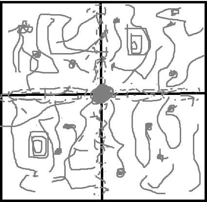

# YesCom - Anarchy Coord Exploit
PogDog Software Suite Presents:

Yescom© - Sequel to Nocom; a project carried out by NerdsInc
Nocom information found here: https://github.com/nerdsinspace/nocom-explanation/blob/main/README.md
The program does everything that the nerds did with theirs, but more practicaly implemented.

# Exploit Behind It

What makes this all possible is very simple, although is sorta tricky to see in the code. I don't care enough to do a fully "why this works" explanation but I'll sum it
up quickly:

* Open any type of foreign container (chest, ender chest, hopper, NOT your inventory).
* Move into any chunk with SPacketPlayerPosition (as well as confirming the teleport with CPacketConfirmTeleport).
* Listen for if you recive a SPacketCloseWindow, which can conclude the chunk is loaded; if you don't recieve the SPacketCloseWindow no one is there

# How Does The Program Work?

The program is essentially split up into 3 different programs which run with 1 api/protocol. 2 clients, 1 server. Here is a rundown/sum-up of what each program is and a bit about what they do:

* Server: This is pretty much just a "bridge" in a way. It only really handles requests and data between the 2 clients and is meant to be run in the backround and not really interacted with by the user. Not much to say about this, if you want to look into how the server works feel free.
* Client 1 (minecraft client): This is essentially the client that interacts with the minecraft server. It also isn't really meant to be interacted with much by the user, it is what handles all packets which need to be queued and sent to the minecraft server, all the accounts and keeping them logged in, as well as all the tracking and scanning process logic. Definitley the most interesting of the few and could run standalone if stripped of some stuff. If you're wondering where the actual coord exploit shit is, well this is it.
* Client 2 (viewer): This is the part that the user actually sees. Written in python because Node is bad, it is what is run of people's PCs instead of our server. People can have multiple of these open, and it synchronously displays all coord exploit data to anyone who is running their own instance of it. You can use this to not only view all the tracked players and loaded chunks, but you can start processes, select chunks to be loaded, and even add and remove accounts from the botnet.

This is a very good way of doing it, as anyone with a registered account can open up the viewer, select the minecraft server they want to be coord exploiting on, add more accounts if they want and start viewing data, querying chunks, etc. All the other programs are running 24/7 on servers and can be accessed whenever needed.

# Information About the Client
The client, as described above, is the client that connects to the given Minecraft server.

## Running the client
To run the client, you will have to build it first:\
From the root directory, `cd client`, then run `./gradlew build`.

Once the client has been built, you can run the program:\
Run the command `java -jar ./build/libs/yescom.jar -h <server ip>`.

## Accounts
To specify **Mojang** accounts for the client to use, you can use the *accounts.txt* (depends on the argument, see below) file to specify accounts.

The synatx is as follows:
 - The accounts must be separated by new lines.
 - The accounts must be in the format `email:password`, where a valid email is `username@domain`.
 - If the line does not start with an email, it will not be read, so you can use punctuation characters such as `#` to "comment" out accounts.

## The config
The client can be configured to use config rules from *config.yml* (depends on the argument, see below), there are quite a few config rules, a lot of them are self explanatory given their names, but I will run through a few of them below:
 - `dont_show_emails` - replaces occurrences of emails with `[REDACTED]` in console.
 - `host_name` - the name of the YC server **(not Minecraft server)** to connect to.
 - `host_port` - the port of the YC server to connect to.
 - `username` - the username to use for the YC server.
 - `group_name` - the name of the group that the user belongs to in the YC server.
 - `password` - the password of the account for the YC server.
 - `login_time` - how often to log accounts in to the Minecraft server, in milliseconds.
 - `queries_per_tick` - the *maximum* number of queries to process per tick.
 - `log_out_health` - the health at which to log accounts out at.
 - `health_relog_time` - how long to wait before relogging an account that logged out due to low health, in milliseconds.
 - `type` - an enum representing which type of loaded chunk check to use, `DIGGING` or `INVALID_MOVE`.
 - `arzi_mode` - better for higher ping, constantly reopens the storage, can limit functionality in other ways however.
 - `reopen_time` - how long to wait before reopening the storage if it fails to.
 - `max_open_attempts` - the maximum number of failed open attempts before relogging the account.
 - `digging_timeout` - how long to wait for a server response before the chunk is declared as unloaded.
 - `render_distance` - the render distance of the server * 2 + 1, so for example, if the render distance is 6, you would enter 13

## Command line options
The client has different command line options that can be used:
 - `-l`, `--logLevel` - used to set the log level of the program, valid options are `finest`, `finer`, `fine`, `config`, `info`, `warning` and `severe`.
 - `-af`, `--accountsFile` - the txt file for the accounts, see above for correct formatting, `accounts.txt` by default.
 - `-rf`, `--configFile` - the YAML file for the config, see above for valid rules, `config.yml` by default.
 - `-h`, `--host` - the IP address of the server to connect to **(required)**.
 - `-p`, `--port` - the port of the server you want to connect to, `25565` by default.
 - `-noyc`, `--noYCConnection` - runs the client standalone, no server required.
 - `-n`, `--handlerName` - the name of the handler, used for YC server connections.

# Was My Base Found?

In short yes, you are in our database, you are compromised, you are absolutely fucked. With a dedicated server and 3 backup virtual ones we have taken no shortcuts to ensure our data collection spans 24 hours 7 days a week. Every newfag, spawnfag, and even millionfags can't hide from the reach of YesCom. Using an alt archive provided by Dom_mld we have traced every individual and their alts to the furthest corners of Constantiam. Fuck you.

