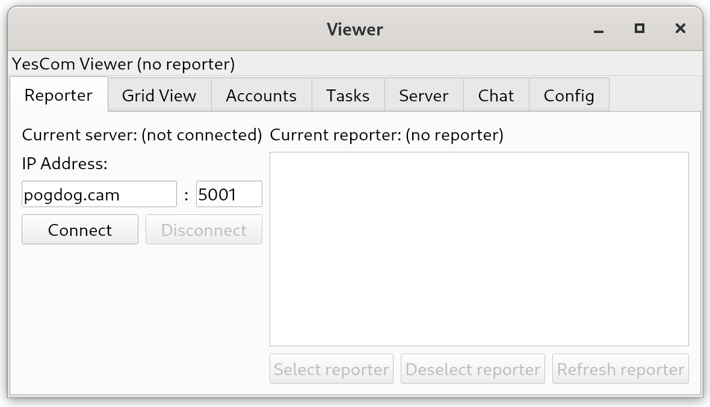

# The Viewer
The viewer is responsible for viewing the data (duh). 
It has the ability to interface with the Minecraft client, such as being
able to add and remove accounts, view trackers, start tasks, etc.



## Running the viewer
**Note: you will need Python 3.9 installed to run the viewer.**

To run the viewer, you will have to install the dependencies first:\
From the root directory, run `./gradlew :viewer:pipInstall`

Once the dependencies have been installed, you can run it:
 - Through gradle: `./gradlew :viewer:run`
 - Through python: `source ./viewer/venv/bin/activate`, `python3 -c "from src.viewer import main; main()"`

If it crashes almost immediately on startup with the following error:
```
QObject::moveToThread: Current thread (<address>) is not the object's thread (<address>).
Cannot move to target thread (<address>)

qt.qpa.plugin: Could not load the Qt platform plugin "xcb" in "./venv/lib/python3.9/site-packages/cv2/qt/plugins" even though it was found.
Qt platform plugin could not be initialized. Reinstalling the application may fix this problem.
```
The fix is as follows:
 - Navigate to the `./viewer/venv` directory, `cd ./viewer/venv`
 - Run `source ./bin/activate`
 - Check `pip3 list`, you should see a line saying `opencv-python`, if not, skip the next step
 - Run `pip3 uninstall opencv-python`
 - Then run `pip3 install --no-binary opencv-python opencv-python==4.5.4.60`
